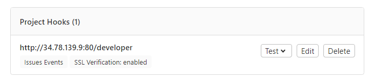
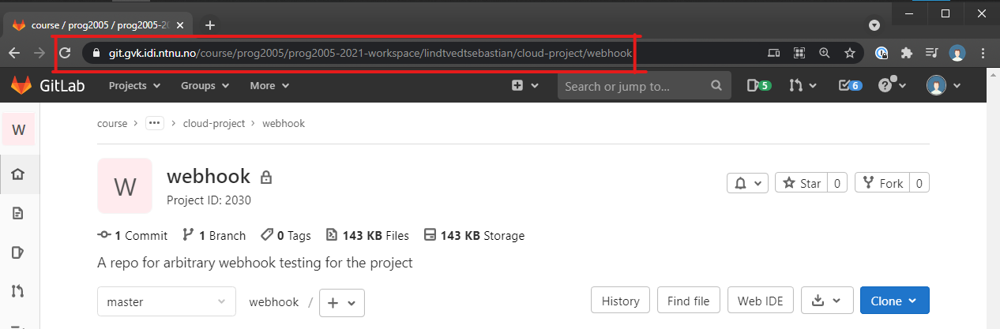
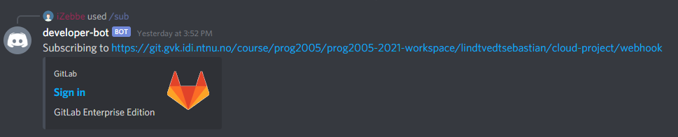
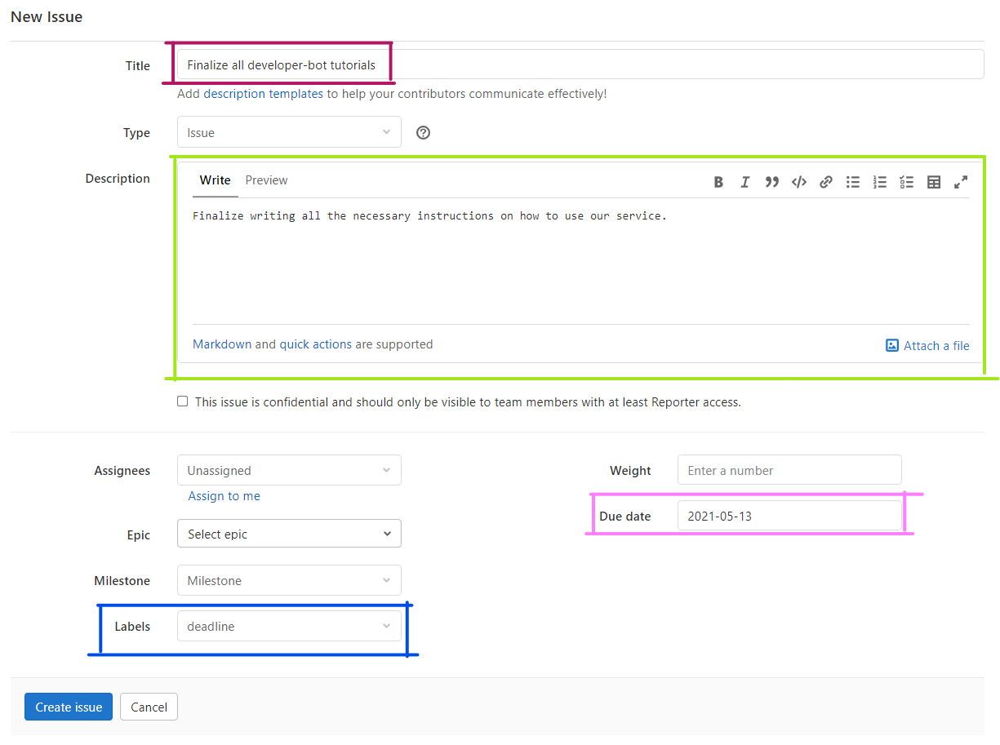
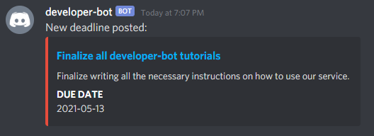
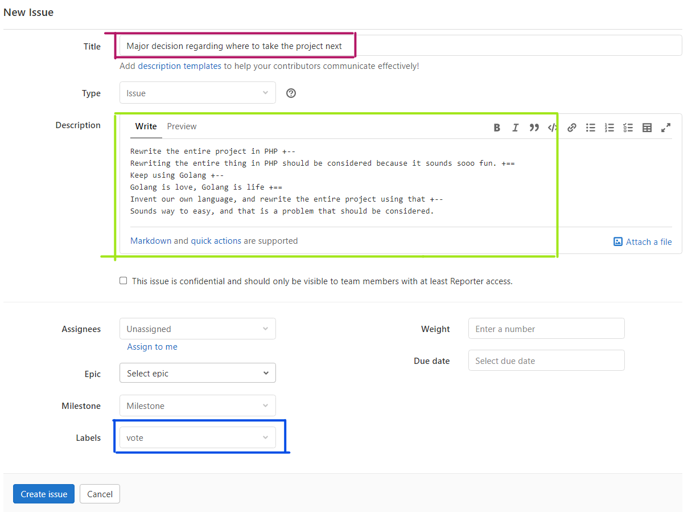
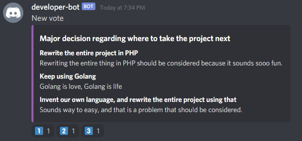
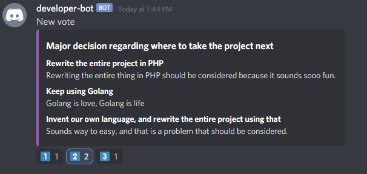
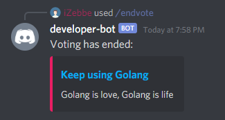

[](https://git.gvk.idi.ntnu.no/course/prog2005/prog2005-2021-workspace/lindtvedtsebastian/cloud-project/developer-bot/-/commits/master)

# Table of contents
[[_TOC_]]

# Developer bot

This is a Discord bot with two main pieces of functionality. It can extract deadlines from GitLab issue tracker, and it can create decision polls on special issues in GitLab. It does this by using GitLab's webhook interface,
in order to receive data from GitLab, and simultaneously runs a discord bot, that facilitates user interaction.

# Using the service
## General
### Registering a new project (repository) on GitLab
The URL for registering new webhooks
```
http://34.78.139.9:80/developer
```

<ol>
<li>Navigate to your desired GitLab project's page</li>
<li>Go to the <code>Settings/Webhooks</code> page in the sidebar</li>
<li>Paste the link to the deployed service's developer endpoint (The link provided above) into the URL field.</li>
<li>Unselect all triggers except for <b>Issues events</b></li>
<li>Leave SSL verification unchanged</li>
<li>Press the <span style="color:white;background-color:dodgerblue">Add webhook</span> button</li>
</ol>
If everything had been set up correctly, you should be able to see the following under Project hooks:



### Registering a new project (repository) in a Discord server
> PUT INVITE LINK TO THE TEST SERVER HERE
<ol>
<li>Navigate to a Discord server which has the developer-bot added to it</li>
<li>Type in the <code>/sub</code> command, followed by the relevant project's URL</li>


<li>In this particular case, the whole command would have been <code>/sub https://git.gvk.idi.ntnu.no/course/prog2005/prog2005-2021-workspace/lindtvedtsebastian/cloud-project/webhook</code></li>
<li>You should receive a confirmation message from the bot indicating that the repository is now being subscribed to</li>


</ol>

### Unregistering a project (repository) in a Discord server
The exact same approach as subscribing, except that you use the `/unsub <Repository url>` command instead
## Deadlines
### Posting a new deadline issue on GitLab
All deadline issues being created in a repository that has been set up with webhook's on GitLab and is being subscribed to in a Discord server will trigger a notification in the relevant Channels. 
<ol>
<li>Navigate to your desired GitLab project's page</li>
<li>Go to the <code>Issues</code> page</li>
<li>Press the <span style="color:white;background-color:dodgerblue">New issue</span> button</li>
<li>Fill in all the necessary fields:
<ul>
<li><span style="color:white;background-color:rgb(179,21,100)">Title</span></li>
<li><span style="color:white;background-color:rgb(162,230,27)">Description</span></li>
<li><span style="color:white;background-color:rgb(0,77,230)">Label (deadline)</span></li>
<li><span style="color:white;background-color:rgb(255,147,255)">Due date</span></li>
</ul>

Example of how a new deadline could look: 

</li>
<li>Press the <span style="color:white;background-color:dodgerblue">Create issue</span> button</li>
<li>The deadline will now appear in Discord


</li>
</ol>

### Fetch all deadlines
All relevant deadlines can be fetched in the Discord channel it was originally sent to. To do so: simply use the `/deadlines` command.
## Voting
### Posting a new vote on Gitlab
The voting system is triggered by a special kind of issue in a registered repository.


<ol>
<li>Navigate to your desired GitLab project's page</li>
<li>Go to the <code>Issues</code> page</li>
<li>Press the <span style="color:white;background-color:dodgerblue">New issue</span> button</li>
<li>Fill in all the necessary fields:
<ul>
<li><span style="color:white;background-color:rgb(179,21,100)">Title</span></li>
<li><span style="color:white;background-color:rgb(162,230,27)">Description</span></li>
<li><span style="color:white;background-color:rgb(0,77,230)">Label (vote)</span></li>
</ul>

Example of how a new vote could look:


<li>The vote will now appear in Discord


</li>
</ol>

#### Important notes regarding the syntax of the vote description
All titles must be followed by `+==`
All descriptions except the last must be followed by `+--`

Full vote description example:
```
Very important title +==
Very descriptive description +--

Very important title two +==
Very descriptive description two
```


### Voting in Discord
You vote on matters by simply interacting with the emojis below the vote message.


### Ending a vote
When one of the team members (The project leader for example) finds the voting to be sufficient, one can simply end it by utilizing the `/endvote` command.



The message then posted to Discord contains a custom link. Following this link will lead the user to GitLab, with prefilled fields to actually make this new issue.

# Development

The development of this project is centered around docker-compose and containerization. You *can* build the 
server as a binary manually, but you will have a more difficult time deploying it.

Both the docker-compose setup and a manual setup requires the presence of a `service-account-key.json` 
from GCP. This is used both to authorize Firestore and Google Cloud's Secret Manager, the latter is where the
Discord bot token is stored and accessed securely. The account key requires the roles `INSERT FIRESTORE ADMIN ROLE` 
and `INSERT SECRET MANAGER SECRET ACCESSOR ROLE`. The key is discovered from the environment variable 
`GOOGLE_APPLICATION_CREDENTIALS`, which contains a path pointing to the service key, default should be 
`./service-account-key.json`. This is made available to the container through docker-compose's secrets or GCP's
provisioning.

## Building

This project can be built in two ways.

### Manually

To build:
```bash
go build -o bin/developer-bot
```

To run:
```bash
./bin/developer-bot
```

Or build and run in one with:
```bash
go run
```

### With Docker

To build an image:
```bash
docker-compose build
```

To run a container based on built image
```bash
docker-compose up -d
```

You can also build and run the container all in one go:
```bash
docker-compose up -d --build
```

And to shut the container down:
```bash
docker-compose down
```

## Continues Integration and Continues Deployment

This project uses a GitLab's CI/CD pipelines to validate the state of the project and to produce artifacts. The CI consists of multiple stages, the descriptions of which you can find below. The purpose of the CI is to catch errors as early as possible, to do regression testing, and to prevent faulty code from going into production. The CI as configured caches all that it can quite aggressively, in order to increase performance and save on network bandwidth. This is necessary as the runner is hosted on Skyhigh, and is quite resource constrained.

The pipeline currently has these stages:
1. Build stage - Builds the project as a normal Go binary, just to make sure there are no config issues or trivial mistakes in syntax.
2. Lint stage - More detailed analysis of the code to find common mistakes and anti-patterns.
3. Deploy-to-dockerhub - Builds the docker container and pushes it to dockerhub.
4. Deploy-to-gcp - Notifies the VM on GCP to reset and pull down the new image.

# Deployment

There are a few considerations to take into account when considering how to deploy the bot. Mainly how it's built, how to run it and keep it running, and how to configure access to the secret token.

The reason we did not use services like Cloud Run, Cloud Functions, or Heroku, is that Discord bots need to be continuously running. They can not just wake up when a request is sent the way these services expect.

## GCP via Container optimized OS

This is the config the current deployment uses.

- Create a new service account with the following roles: ...
- Build the docker image locally and upload it to your preferred container registry
- Create a new VM instance in GCP
- Select deploy container
- Fill in the URL to your container image
- Select a container optimized OS
- Select the service account you just created
- Select allow http traffic
- Click start VM. Everything is automatic from here

## Manually on OpenStack or other IaaS solution

- Manually copy over a service account key
- Deploy using docker-compose
- Or directly with docker, setting up the tmpfs binding manually
- Or using dockers swarm mode

## Heroku

The current stack can not be deployed to heroku, due to heroku's poor handling of secrets. These were the instructions back when it worked.

There are two main methods for deploying the app to Heroku. The default Heroku way, using the heroku-20 stack. Or by deploying the app as a container using the container stack. The default way is configured by the `Procfile`, and the container way is configured by `heroko.yml` and the `Dockerfile`.

Deploy the default way:
```bash
# Login to heroku if you aren't already
heroku login
# Create the heroku app
heroku create
# Set the secret bot token
heroku config:set TOKEN=<...>
# Deploy to heroku
git push heroku main
```

To configure heroku to deploy the app as a container, run the following commands just before first deploying to heroku:
```bash
# Set the stack to container as opposed to heroku-20
heroku stack:set container
# Redeploy
git push heroku main
```

## Security

Quite a lot of time was spent figuring out how to deploy, and preferably develop, this project with security in mind. We considered any security through obscurity to be unacceptable. So hard coding or environment variables are out the door. We explored using HashiCorp Vault and many other similar products, before finally settling on using GCP's built in security features. Namely service accounts and the secrets manager. Here we set up granular permissions via service accounts. And securely store the discord bot token with encryption at rest and in transit. The service account key necessary to facilitate authentication and secure communicating is passed into the container with use of docker's built in secrets mechanisms, and works the same way when developing, as when deploying. This setup provides both a good level of security, and is relatively comfortable while developing.
